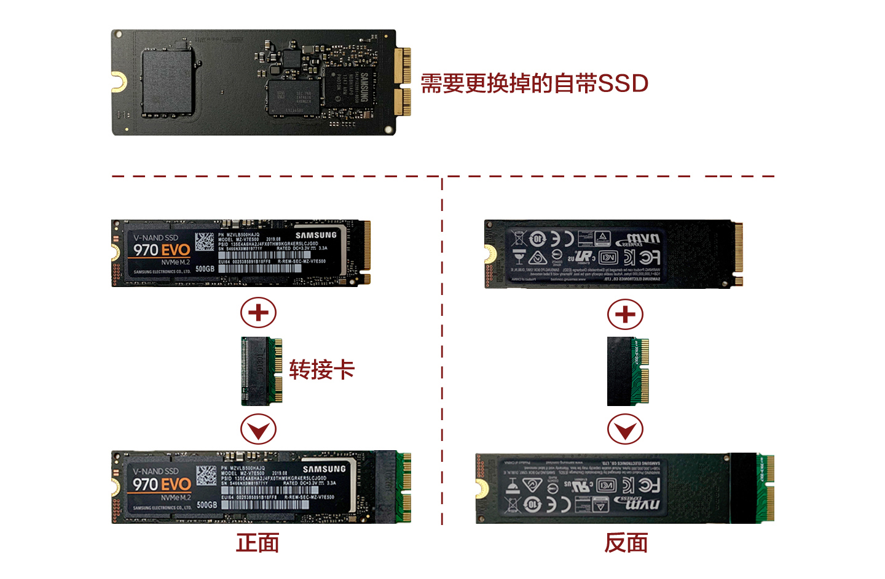

# iMac 27英寸 2017款更换 CPU 和 SSD 固态硬盘拆机教程

## 准备

1. CPU（7700K）
2. 硅脂
3. 固态硬盘（三星 970 EVO 500GB）
4. 转接卡（非苹果原装 SSD，需要转接卡适配卡槽）
5. 屏幕胶
6. 拆机工具
7. 螺丝刀（T8、T10、T25 和 PH0）

---

## 步骤1 取显示屏

* 从显示屏左方的缝隙中插入转盘滚轮。
* 推着让转盘旋转（不要拉），多划几次，确保屏幕胶分离。

* 上方划开显示屏。

* 右方划开显示屏。

---

## 步骤2 打开屏幕

* 将 iMac 屏幕朝上放在桌面上，用一张塑料卡慢慢移动沿着显示屏划开左、上、右方屏幕胶。

  > 注：摄像头的位置不要太深，防止损坏。

---

## 步骤3 断开电源线和数据线

* 从顶部慢慢抬起显示屏。

  > 不要抬太高，里面有 2 根连接线。
* 用一只手握住显示屏的同时，另一只手拔下电源线。

* 打开数据线上的金属盖片并拔下。

---

## 步骤4 取下显示屏

* 将显示屏抬高到接近垂直的位置，此时底部仍有屏幕胶，上下慢慢抬放几次使屏幕胶松动。

* 用手从一边撕掉（或塑料卡切割）屏幕胶，将显示屏取下。

  > 注：一定要非常小心

---

## 步骤5 卸底部螺丝

* 卸下底部 9 颗螺丝，取出黑色长片（为了其他部件稍后不受阻挡）。

---

## 步骤6 取左扬声器

* 卸下 2 颗螺丝。

* 将 `左侧扬声器` 的连接线从电源上拔出。

* 使用撬棒切断电源线与主板之间的连接，沿着硬盘与主板的缝隙取出。

  > 注：切勿触碰任何主板上的金属焊点。

* 将扬声器向上抬起，取出扬声器，连接线从扬声器的槽中取出。

---

## 步骤7 取硬盘

* 将 SATA 电源线向上拉与硬盘断开连接，卸下 2 颗 `左硬盘支架` 上的螺丝。

* 拿住硬盘向左，取下硬盘（我的原装机械硬盘已经被更换为 SATA 固态）。

---

## 步骤8 取电源

* 拔掉右侧电源线，卸下电源上的 4 颗螺丝。

  > 注：切勿触碰电源上的任何电容、导线以及焊点。

* 将电源向左，使其能看到底部连接线，将 2 根连接线分别从主板和电源上拔出，取下电源。

  > 注：连接线有卡扣，请小心谨慎，防止损坏

---

## 步骤9 取右扬声器

* 卸下 2 颗螺丝，轻轻向右摇晃扬声器，使其与主板松开。

* 断开连接线，将扬声器向上抬起，并取出。

---

## 步骤10 取风扇

* 将风扇连接线与主板断开；卸下 3 颗螺丝。
* 向下压风扇与排风管道相连的黑色带子会自动脱胶，取出风扇。

---

## 步骤20 取主板

* 将四个连接 AirPort 和蓝牙天线的连接线断开。

  > 注：防止之后装机错乱，建议使用胶带固定

* 掀开摄像头数据线的金属固定支架，将连接线朝 iMac 顶部方向拔出。

* 将耳机孔连接线与主板上断开。

* 将硬盘 SATA 线从右侧硬盘支架拉出，放到右侧。

* 卸下散热片顶部 2 颗螺丝。

* 麦克风线拔下；卸下主板正面 8 颗螺丝，左侧 1 颗长行螺丝（T25 螺丝刀），取出主板。

  > 注：麦克风连接线非常小，请仔细小心

---

## 步骤21 换 SSD

* 将主板翻过来，看到 SSD 固态硬盘位置。

* 卸下 SSD 上的 1 颗螺丝。

* 将 SSD 从末端轻轻的抬起来并把它从主板上的插槽中拔出来。

  > 注：防止损坏插槽，请不要过度抬高 SSD 的末端。
* 新 SSD 装上 `转接卡`。

* 插入主板上插槽内，拧上螺丝。

---

## 步骤22 换 CPU
* 卸下 CPU 背面 4 颗螺丝。

* 用撬棒将 CPU 取下。

* 清除硅脂。

* 将 7700K CPU 放入原位。

---

* 将硅脂涂在 CPU 表面。

---
## 步骤23 装机
> 友情提醒：装机前请清理灰尘。

* 按照拆机过程的倒序安装，安装主板时建议插个 U 盘，防止位置不对。

* 屏幕胶勿挡住麦克风。

  > 注：屏幕胶先粘贴一面，待系统安装完成，检查完整性后再撕掉另一面。

---
## 步骤24 装系统

---
## 步骤35 完成
* 撕掉屏幕胶的另一面，将显示屏和机身吻合，按压四周使其紧密贴合。

  > 注：自带的机械硬盘如不卸可作为存储盘使用（当然也可以卸下，取决于个人需求）。