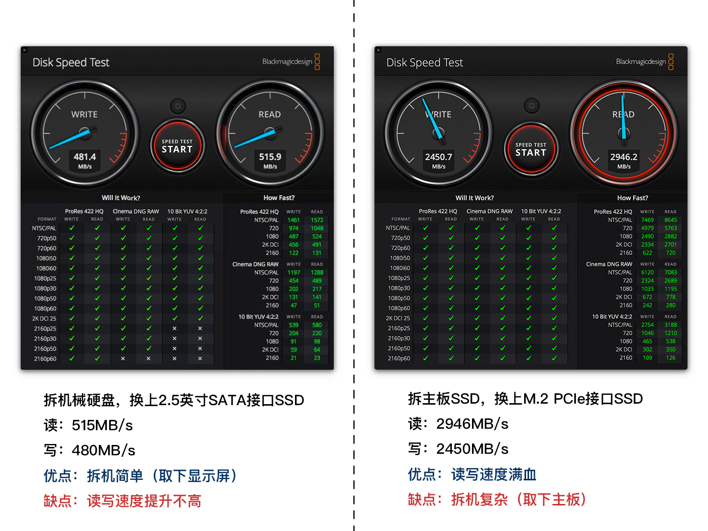
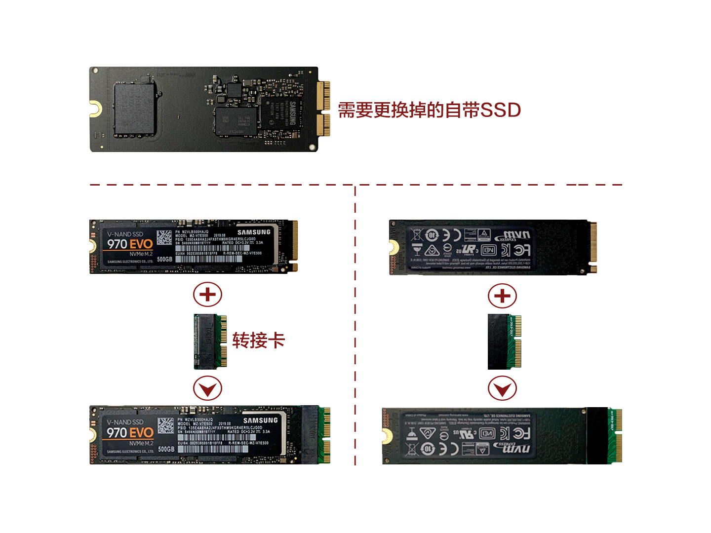
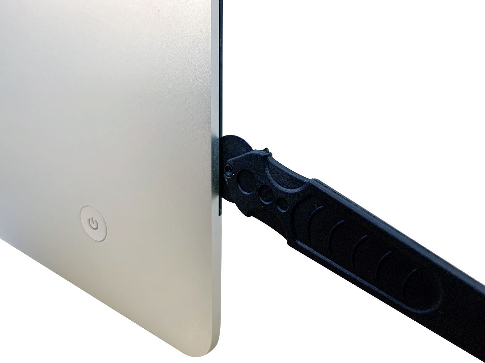
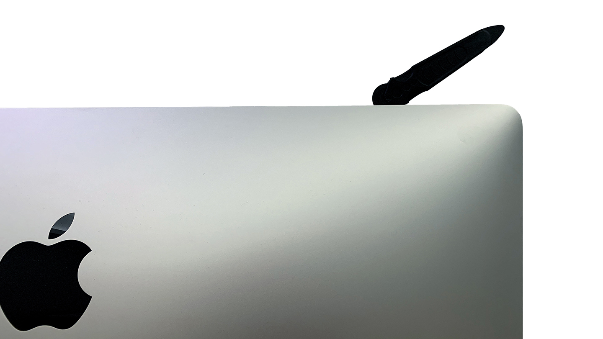
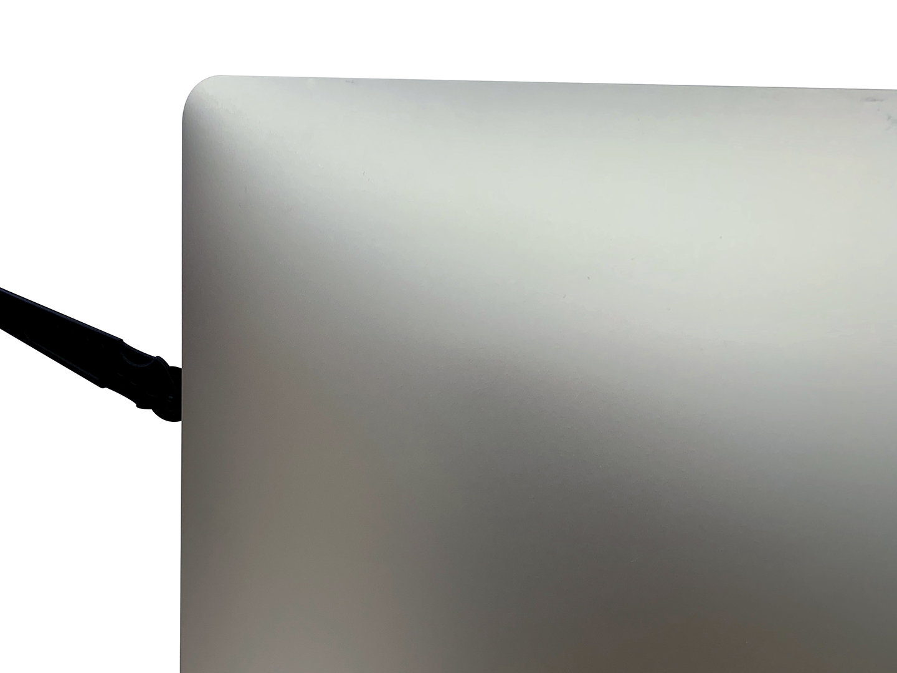
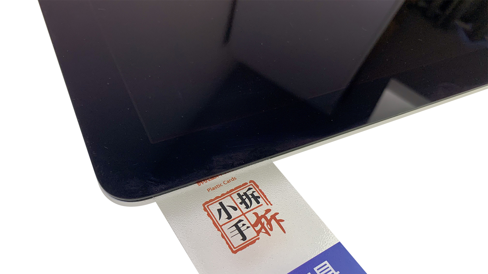
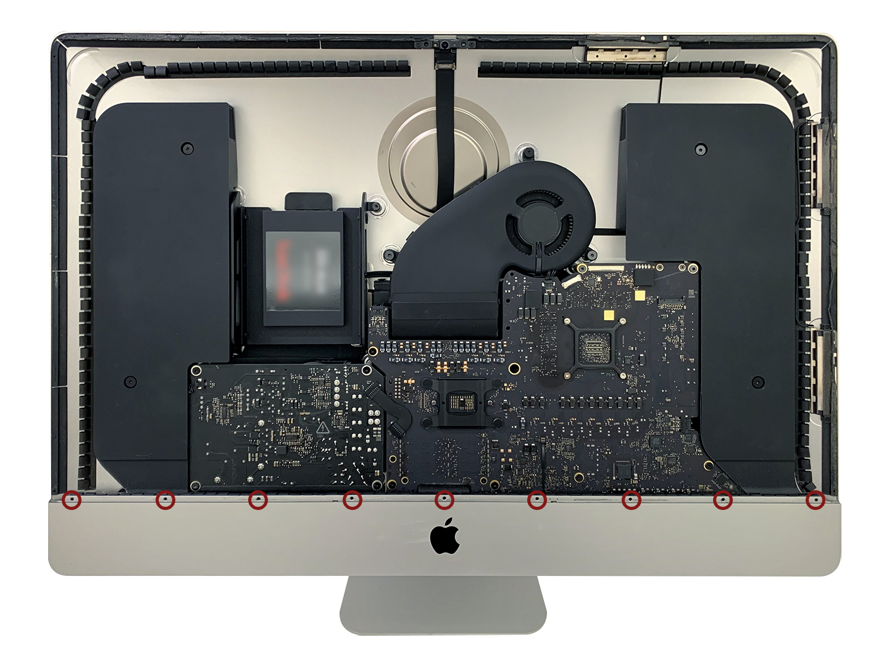

# iMac 27英寸 5K 2017款更换 M.2 SSD 固态硬盘拆机详解 

## 话不多说，先跑个分

* 左：卸下机械盘，换 `SATA` 接口 SSD 和自带 32GB SSD 融合后，上图左实际是自带 SSD 的速度，读写 3 次后会低至 100-300 MB/s，此时才是 `SATA` 接口 SSD 的速度，只能满足日常使用。【融合后 Final Cut Pro 卡，不融合 Photoshop 卡，个人遇到这个 BUG 真的恼火。】
* 右：卸下自带 32GB SSD，换 `M.2` 接口 SSD，速度已接近官方数值，可以说发挥了该有的性能，表现优异各大应用流畅度提升明显。

---
* 非苹果原装 SSD，需要转接卡适配卡槽。

## 前期准备
1. `M.2` 接口 SSD 固态硬盘（本文选择三星 970 EVO 500GB，679 元）
2. `M.2` 转接卡（12 元）
3. 屏幕胶（20 元）
4. 拆机滚轮（10 元）
5. 螺丝刀：T8、T10、T25 和十字口（25 元）
---
## 步骤1 取显示屏
* 从显示屏左方的缝隙中插入转盘滚轮。
* 推着让转盘旋转（不要拉），多划几次，确保屏幕胶分离。

---
## 步骤2
* 上方划开显示屏。

---
## 步骤3
* 右方划开显示屏。

---
## 步骤4
* 将 iMac 屏幕朝上放在桌面上。
* 用一张塑料卡慢慢移动沿着显示屏划开左、上、右方屏幕胶。
* ⚠️摄像头的位置不要太深，否则会损坏。

---
## 步骤5
* 从顶部慢慢抬起显示屏。
* ⚠️不要抬太高，里面有 2 根连接线。
* 用一只手握住显示屏的同时，另一只手拔下显示电源线。

---
## 步骤6
* 打开数据线上的金属盖片并断开。

---
## 步骤7
* 将显示屏抬高到接近垂直的位置。
* 此时，显示屏底部仍有屏幕胶，上下慢慢抬放几次使屏幕胶松动。
* 用塑料卡切割底部屏幕胶。

---
## 步骤8
* 将显示屏抬起并取下。
* ⚠️一定要非常小心。
* 卸下底部 9 颗小螺丝，取出黑色长片，是为了其他部件不受阻挡容易取出。

---
## 步骤9 取左扬声器
* 卸下 2 颗螺丝。

---
## 步骤10
* 将左侧扬声器的连接线从电源上拔出。

## 步骤11
* 使用撬棒切断电源线与主板之间的连接。
* 沿着硬盘与主板的缝隙取出。
* ⚠️切勿触碰任何主板上的金属焊点。

---
## 步骤12
* 将扬声器向上抬起，取出扬声器。
* 将连接线从扬声器的槽中取出。

---
## 步骤13 取硬盘
* 将 SATA 电源线向上拉起来与硬盘断开连接。
* 卸下 2 颗左硬盘支架上的螺丝。

---
## 步骤14
* 拿住硬盘向左，取下硬盘。

---
## 步骤15 取电源
* 切断电源线。
* ⚠️切勿触碰电源上的任何电容、导线以及焊点。
* 卸下电源上的 4 颗螺丝。

---
## 步骤16
* 将电源向左侧移动，然后再向上使其能看到底部连接线。
* 将 2 根连接线分别从主板和电源上拔出。
* ⚠️小心谨慎，防止损坏。
* 取下电源。

---
## 步骤17 取右扬声器
* 卸下 2 颗螺丝。
* 轻轻地向右摇晃扬声器，使其与主板松开。

---
## 步骤18
* 使用撬棒将插头向右移动使其从主板上分离。
* 将扬声器向上抬起，并取出。

---
## 步骤19 取风扇
* 将风扇连接线与主板断开。
* 卸下风扇上的 3 颗螺丝。
* 向下压风扇与排风管道相连的黑色带子会自动脱胶，取出风扇。

---
## 步骤20 取主板
* 将四个连接 AirPort 和蓝牙天线的连接线断开。
* ⚠️防止后面装机四个连接线错乱，建议使用胶带固定。

---
## 步骤21
* 翻转连接摄像头数据线的金属固定支架。
* 将相机连接线朝 iMac 顶部方向拔出。

---
## 步骤22
* 将耳机孔连接线与主板上断开。

---
## 步骤23
* 将硬盘 SATA 线从右侧硬盘支架拉出，并放到右侧。

## 步骤24
* 卸下散热片顶部 2 颗螺丝。

---
## 步骤25
* 卸下主板正面 9 颗螺丝（中间一个取不出）。

---
## 步骤26
* 轻微移动主板，将其向上抬起取出主板。
* 将主板翻过来，就可以看到 SSD 固态硬盘。

---
## 步骤27 取 SSD
* 卸下 SSD 固定在主板上的1颗螺丝。

---
## 步骤28
* 把 SSD 从末端轻轻的抬起来并把它从主板上的插槽中拔出来。
* ⚠️未了防止损坏插槽，请不要过度抬高 SSD 的末端。

---
## 步骤29 装 SSD
* 将 SSD 插入 `M.2` 转接卡上。
* 插入主板上插槽内，并拧上螺丝。

---
## 步骤30 友情提醒
* 从机箱内向下吹气，可以清除被网格挡在外的灰尘。

---
## 步骤31 装机
* 按照倒着拆机顺序安装，别忘记每个线路连接好。
* ⚠️屏幕胶请勿先撕开双面，待系统安装完成再粘合。
* 屏幕胶别挡住麦克风。

---
## 步骤32 安装系统
两种方法：
1. [通过恢复功能重新安装 macOS](https://support.apple.com/kb/HT204904)
2. [U 盘创建 macOS 安装器](https://support.apple.com/kb/HT201372)
* 友情提示：如有备份，安装 macOS 后设置界面，有从备份盘迁移恢复数据选项。

---
## 总结
* 970 EVO SSD 没有出现睡死情况，可以说非常完美。
* 不建议更换 SATA 接口的固态硬盘，速度提升不大，对于使用 Final Cut Pro， Photoshop 等设计用户不够友好，`M.2` 接口 SSD 才是最佳选择。
---

